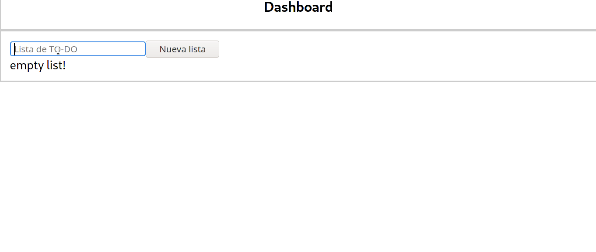

# CHALLENGE - TODO LIST EJ JAVA #

## Summary ##

En este desafió se presenta para poder realizar un TO-DO List en tiempo optimo, con las características necesarios para exponerse como un **Full-Stack Developer**.

Para presentar este reto debes tener conocimientos con las siguientes tecnológicas:

 *  Java 8
 *  Angular (opcional)
 *  MySQL

*No es necesario tener dominada las tecnologías, dentro del reto se entregará algunas guías para ayudar en el proceso, pero si es necesario conocerlas para que pueda ser facil entender la guías.*

## Use Case/Problem ##

Se tiene presente un formulario donde se registra unas tareas basadas en una lista por hacer. Esta lista se crea para poder tener una grupos de items donde se pueda gestionar un CRUD. Se tiene un diseño muy básico pero totalmente funcional.

  

Dentro del back-end no se tiene una base de datos basada en servidor. Se debe aplicar un buen diseño de modelo entidad relación y aplicar una base de datos como servidor, ejemplo MySQL. Representar un objeto de trasporte de datos (DTO) en vez de usar la misma entidad para responder.

## Evaluation criteria ##

| Criteria                                                 | Percentage |
| -------------------------------------------------------- | ---------- |
| Aplica principios de programación orientada a objetos    | 30.0 %     |
| Persistencia de entidades por medio de una base de datos | 30.0 %     |
| Principios y buenas practicas de programación            | 30.0 %     |
| Controla los datos por medio de una presentación visual  | 10.0 %     |
